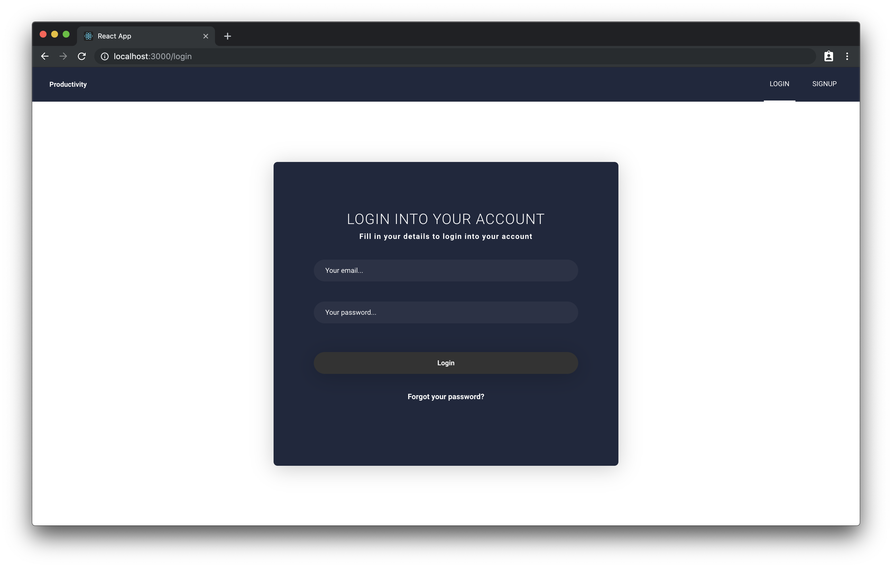
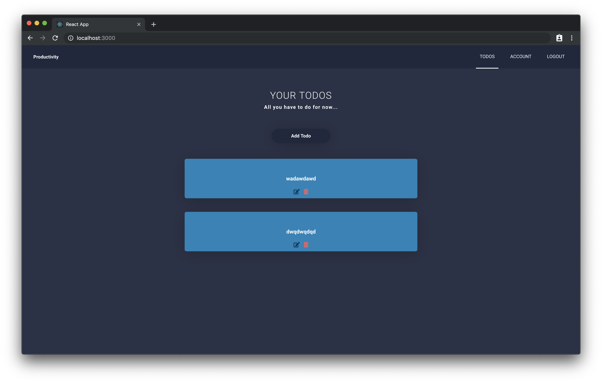
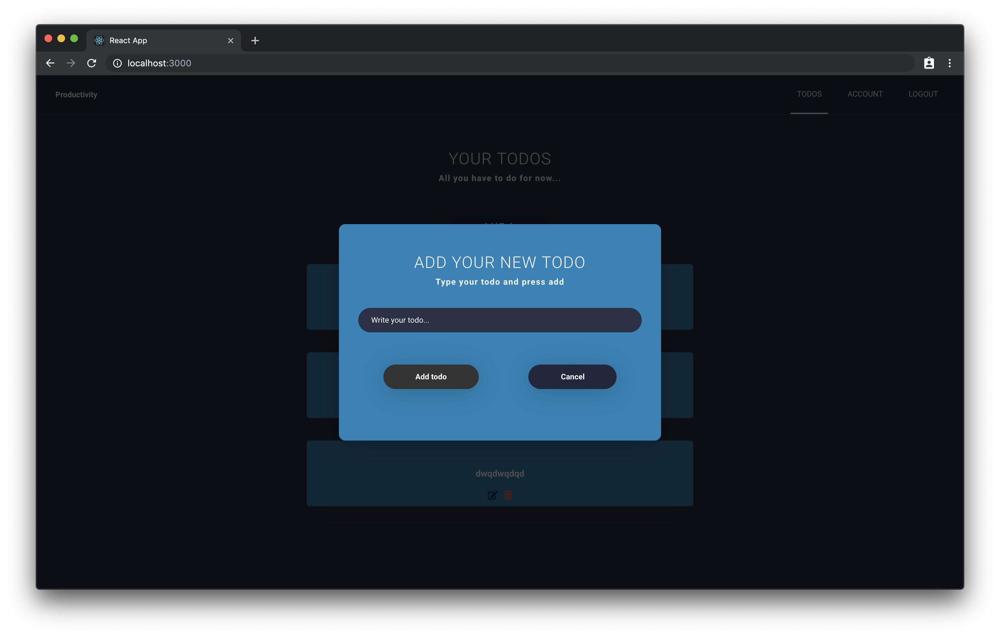

# Todo App w/ Auth

## [Full youtube tutorial here](https://www.youtube.com/watch?v=OHQvbiQpGC8&list=PLoH-uUW2wEIQU3diUzrpFaFOcXM8z8gBc&fbclid=IwAR1wppn59LBfNen_Lpq0mEFaqxQymX9fAzbpeVht3TuShkXidaBVJ9fyhhU)





A todo App with Authentication using Firebase. Todos are saved using Firestore.

### Installing

Clone the Repository and run

```
npm install
npm run dev
```

## Deployment

To deploy simply run

```
npm run build
```

## Built With

- [React JS](https://reactjs.org/)
- [React Router](https://github.com/ReactTraining/react-router)
- [Redux](https://redux.js.org/)
- [Redux Thunk](https://github.com/reduxjs/redux-thunk)
- [Styled Components](https://www.styled-components.com)
- [Firebase & Firestore](https://firebase.google.com)

## Contributing

Please feel free to send pull request if you want to contribute!

## Authors

- **Fidalgo** - _Development_ - [Fidalgo](https://github.com/fidalgodev)
